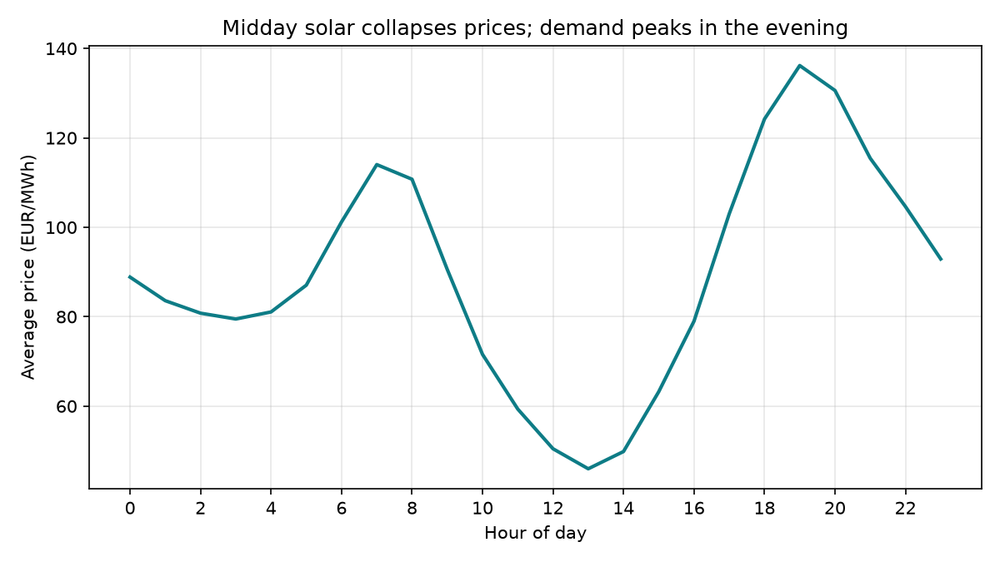
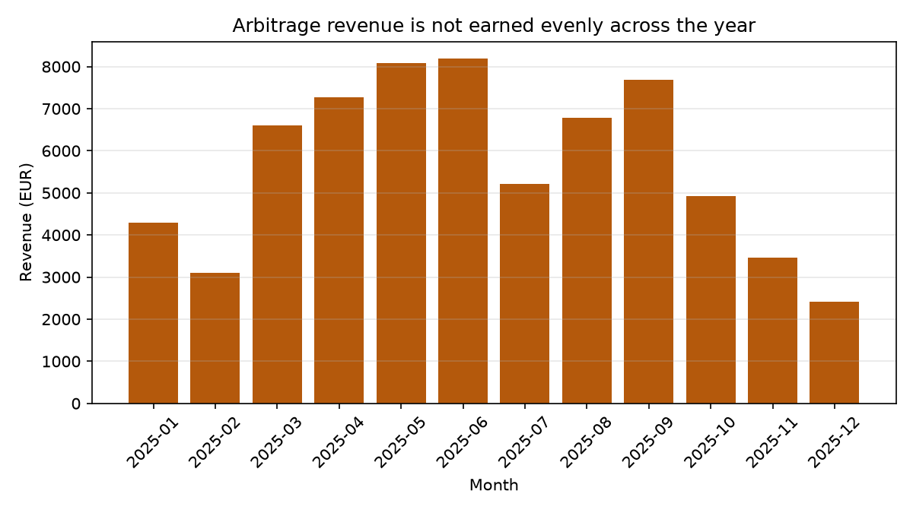
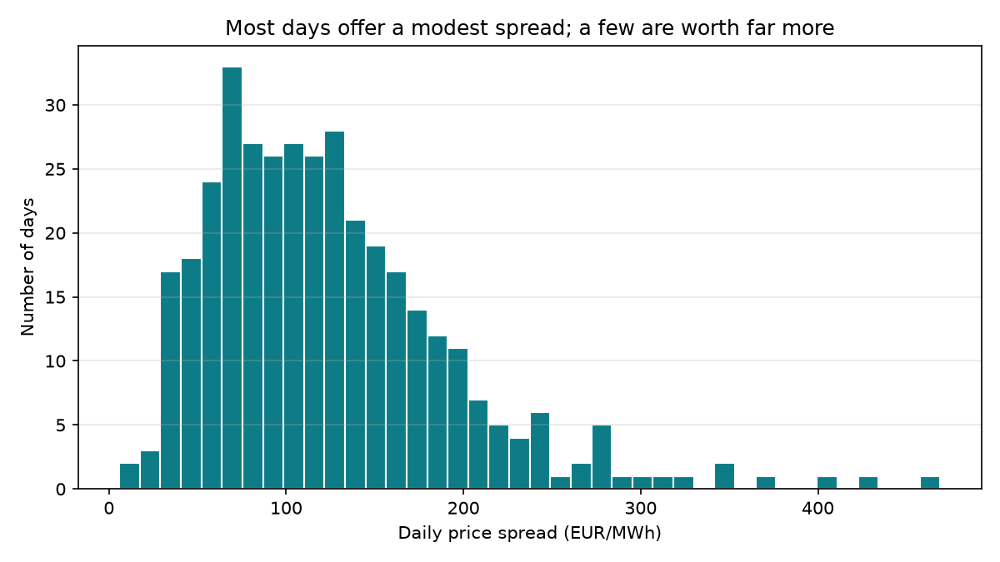

# Battery Storage Energy Arbitrage, German Day-Ahead Market

How much revenue a 1 MW / 2 MWh grid-scale battery would have earned in 2025
by buying electricity in the cheapest hours of each day and selling it in the
most expensive, on real German day-ahead market prices.

Built with Python, Pandas and SQLite.

## Findings

- A 1 MW / 2 MWh battery would have earned **EUR 68,050** across 2025.
- The best single day earned **EUR 687** on 2025-05-11, and **0** days would have lost money.
- **573** of 8,760 hours had negative prices, hours where a battery is *paid* to charge.
- Revenue is strongly seasonal, concentrated in **JUNE**.
- A naive forecast (same hour, one week earlier) captures **79.3%** of the
  perfect-foresight revenue, quantifying how much of this result depends on
  knowing prices in advance.

## Charts

Solar output drives prices to their daily low around midday, while demand peaks
in the evening. That gap is what the strategy captures.

Most days offer a modest spread. A small number of high-spread days account for
a disproportionate share of the annual total.

## Data

Day-ahead wholesale electricity prices for the Germany/Luxembourg bidding zone,
1 January to 31 December 2025, hourly resolution, 8,760 rows.

## Data quality

- All 365 days contain exactly 24 hourly prices, checked explicitly rather than assumed.
- 573 of 8,760 hours had negative prices. These were kept, not cleaned, because
  they are the most valuable hours for a battery, since it is paid to charge.
